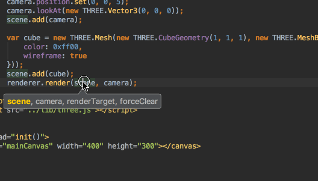
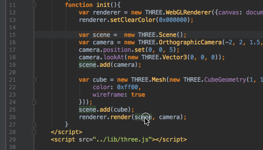
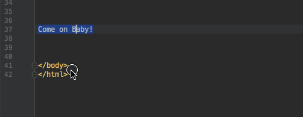
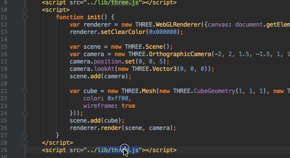
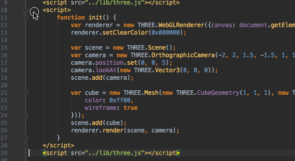
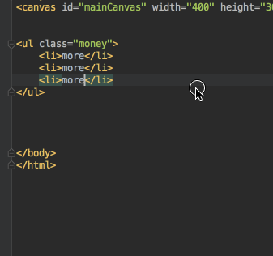
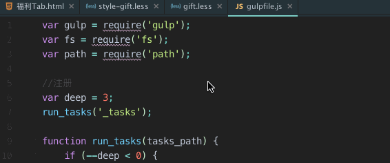

## 常用快捷键卡片翻译文档

> 官方推荐常用快捷键文档
> `Help` > `Keymap Reference`    
> 一般来说 Mac 下的 `CMD`键对应 Windows 下的`Ctrl`键,`Option`对应`Alt`

## 万能快捷键

> 双击 `Shift' 搜任何东西,快捷键也好功能也好,简直666

## Editing 编辑相关

`Ctrl`+`空格`     
Basic code complete    
基本代码补全 (Class命名,方法或变量,目录里的文件列表等)
> 一般来说都会在写代码的时候被动跳出来提示,如果没有跳出,也可以按这个快捷键来主动触发    
> 这个快捷键和输入法切换冲突,我是推荐改成 `Shift`+`空格` 

`CMD`+`P`     
Parameter info      
参数信息

`CMD`+`光标悬浮`     
Brief info      
简介
> 同时可以直接点函数名跳函数定义,或目录名列目录文件等

`Option`+`CMD`+`t`     
Surround with..     
大包围
> 可以配合选中代码块的 `Option`+`↑` 快速选中代码块并外包一层

`CMD`+`/`     
Comment/uncomment with line comment     
行注释 (不配图,请自行脑补)

`CMD`+`Shift`+`/`     
Comment/uncomment with block comment     
块注释 (不配图,请自行脑补)

`Option`+`↑`      
Select successively increasing code blocks     
多次连击可持续选择爹元素块儿

> 选中代码块另一个快速的方式是双击标签行首的空白

`Option`+`↓`      
Decrease current selection to previous state   
多次连击可持续回滚上条的操作

> 配图同上条

`Option`+`CMD`+`l`      
Reformat code     
格式化

> 格式化的风格可以在 Settings > Editor > Code Style 里配置

`Shift`+`CMD`+`v`      
Paste from recent buffers...     
最近复制列表中粘贴

`CMD`+`d`      
Duplicate current line or selected block     
复制当前行或选中的代码块

`Option`+`f` _（需自定义此快捷键）_     
设置方法：[设置] - [Keymap] - 搜索"Finder" - 然后设置成自己想要的快捷键，如：`Option + f`    
Reveal in Finder      
在 Finder 中打开当前文件的位置

