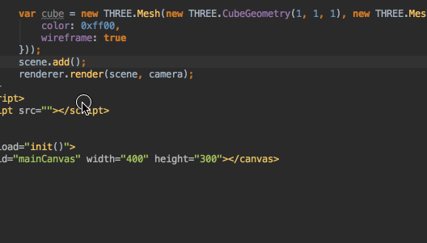

## 常用快捷键卡片翻译文档

> 官方推荐常用快捷键文档
> `Help` > `Keymap Reference`    
> 一般来说 Mac 下的 `CMD`键对应 Windows 下的`Ctrl`键

## 万能快捷键

> 双击 `Shift' 搜任何东西,快捷键也好功能也好,简直666

## Editing 编辑相关

###`Ctrl`+`空格` 
Basic code complete(the name of any class, method or variable)    
基本代码补全 (Class命名,方法或变量,目录里的文件列表等)
> 一般来说都会在写代码的时候被动跳出来提示,如果没有跳出,也可以按这个快捷键来主动触发    
> 这个快捷键和输入法切换冲突,我是推荐改成 `Shift`+`空格` 

###`Ctrl`+`Shift`+`空格` 
Smart code complete (filters the list of methods and variables by expected type)    
智能代码补全 (判断变量或方法类型来提示)
> JavaScript 弱类型基本用不到... 

###`CMD`+`Shift`+`回车` 
补全声明
> JavaScript 弱类型基本用不到... 

